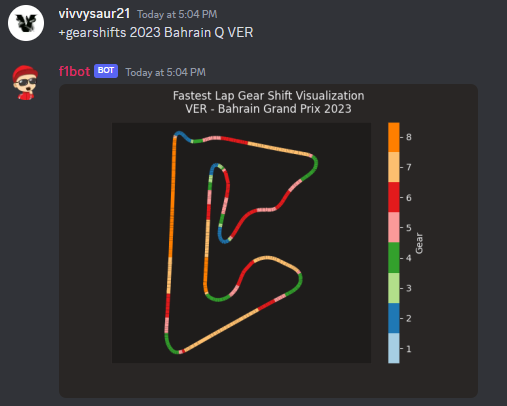
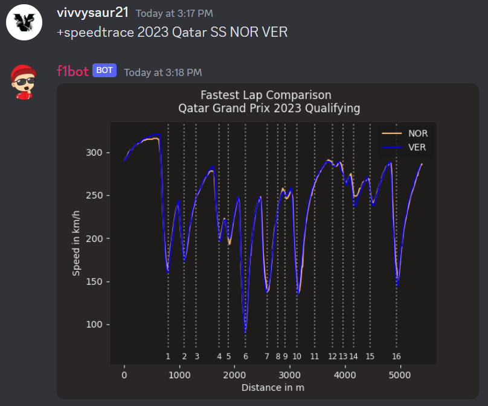
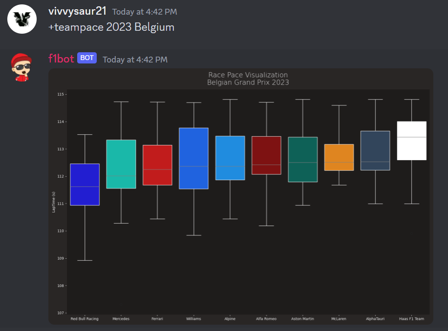
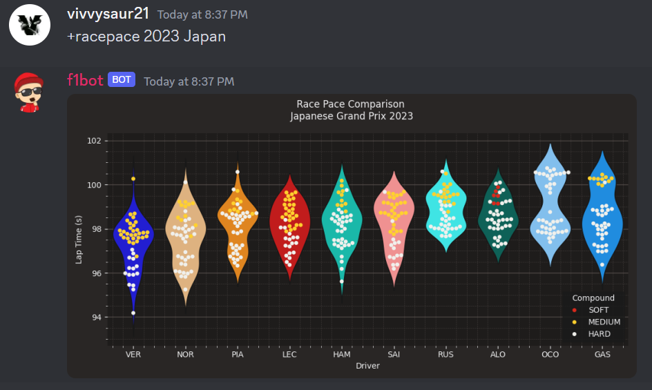

# f1bot
A simple discord bot that returns data about Formula 1 sessions of the past and present. Hosted on AWS.

### Now Live : Data Visualization Commands

* `+gearshifts <year> <race> <session> <driver>` : returns a plot showing which gear is being utilised by a driver at different points on the specified track.
  

    

* `+speedtrace <year> <race> <session> <driver1> <driver2>` : returns the two drivers' speedtraces for the given session, along with annotated corner numbers for comparison.
  

    

* `+teampace <year> <race> ` : returns a box-plot visualizing and ranking each of the 10 teams' race pace.
  

    
    
* `+racepace <year> <race>` : returns a swarm-plot of the top-10 drivers' laptimes over the given race session.
  

    

### Command Usage

* [Invite](https://discord.com/api/oauth2/authorize?client_id=951889203581579304&permissions=274878294080&scope=bot) the bot to your server. 

* `+f1` : returns data about the upcoming Formula 1 session.
  

    
* `+remind f1` : functions as a reminder, notifies the user of the upcoming race session by @username push-notification 5 minutes before the start of a session.
  

    
* `+drivers` : returns drivers' standings.
  

    
* `+teams` : returns teams' standings.
  

    

### Coming Soon

  
### Built With

* JDK 17
* JDA
* Python 3.10
* discord.py
* FastF1 

### Contact

Vivek Pokale - vpokale21@gmail.com
